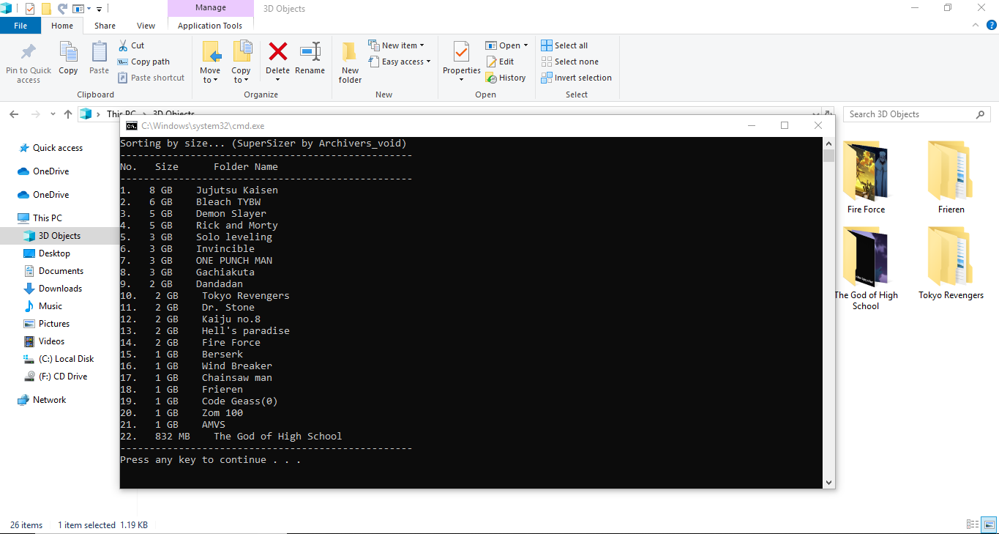

# SuperSizer
A handy cmd tool that displays folders taking up space in a directory

-------How this works--------
## Preview

Download the SuperSizer.cmd file.
Move the file to the required directory.
Double-click and it shows the folders taking up space in ascending order.
